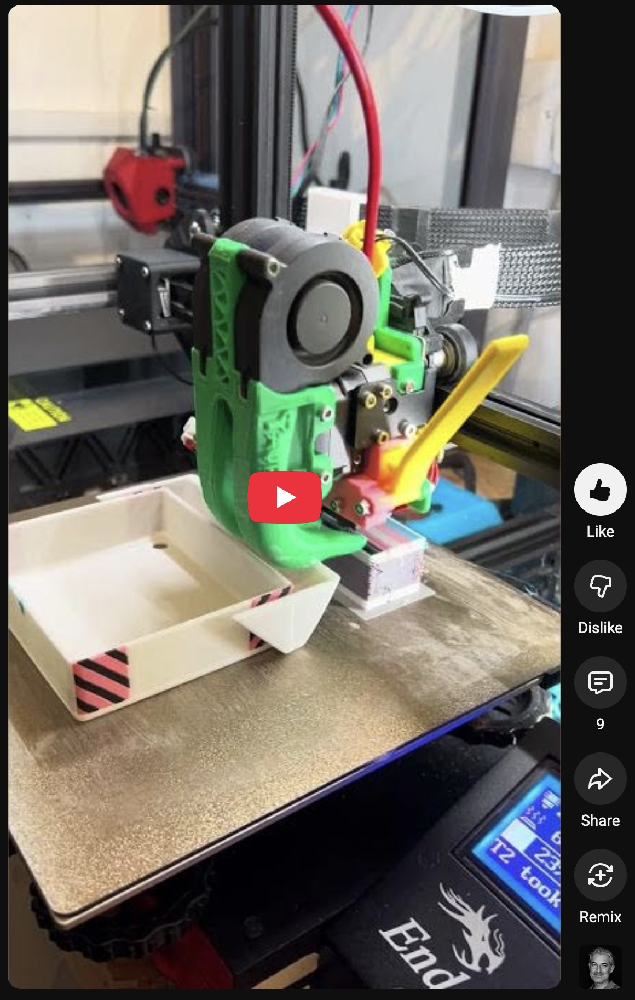

Klipper MMU3
------------

[](https://www.youtube.com/shorts/F7y-2ut8eFo)

This project contains the required config and code files to enable MMU3
hardware on klipper based 3d printers.

This is based on the GCode macro based version distributed with Klipper. But,
it is quite a bit enhanced and all the functionality has been moved to Python.
This itself supplied a better development environment for all the features
missing on the original version. On top of the original version this has the
following features:

- Support for [MMU3-12x project](https://github.com/cjbaar/prusa-mmu-12x)
- Sensorless homing for the selector
- MMU specific menus
- Cut filament in MMU functionality (Only available for MMU3-5x)
- Smoother load/unload experience
- Easier path to future implementations

Currently, for ease of development, as it is hard to fit Klipper firmware to
the board, instead of the Prusa MMBoard, an SKR Mini E3 v3 is utilized, and all
the configuration files are based on that. But, theoretically this should work
with the Prusa MMBoard.

Installation
------------

No installation scripts yet. Just follow the steps:

1. Copy the `mmu3.py` to `~/klipper/klippy/extras/`
2. Copy `mmu3.cfg`, `mmu3_menus.cfg` and `beep.cfg` to your config folder, typically `printer_data/config`.
3. Add `mmu3.cfg` to your `printer.cfg`.
4. Update `mmu3.cfg` according to your setup.
   - Specifically update the `filament_switch_sensor_name` and
     `filament_motion_sensor_name` parameters to match your printer config.

     ```ini
     [mmu3 MMU3]
     filament_switch_sensor_name: filament_switch_sensor my_filament_sensor
     filament_motion_sensor_name: filament_motion_sensor encoder_sensor
     ```

Usage
-----

It is very hard to explain all the functionalities here.

Typically you don't need to know all the commands, the menus supply all the necessary functionality to prepare MMU for printing and troubleshoot. Just add the following GCode to your Machine start G-Code, somewhere after all the normal homing, bed leveling stuff finished and before any filament is used:

```gcode
HOME_MMU
SELECT_TOOL VALUE=-1
T[initial_tool]
```

The extension supplies all the necessary gcode commands.

1. `Tx`

   The tool change command, i.e. `T0`, `T1`, `T2`, `T3`, `T4`, `T5`, `T6`,
   `T7`, `T8`, `T9`, `T10`, `T11`.

2. `HOME_MMU`

   Homes the MMU idler and selector. Typically add this to your Machine start
   G-Code command as explained above.

3. `SELECT_TOOL`

   Selects the requested slot:

   ```gcode
   SELECT_TOOL VALUE=0
   ```

4. `LOAD_FILAMENT_TO_FINDA` / `UNLOAD_FILAMENT_FROM_FINDA`

   Loads/Unloads the filament to FINDA.

5. `LOAD_FILAMENT_TO_EXTRUDER` / `UNLOAD_FILAMENT_FROM_EXTRUDER`

   Loads/Unloads the filament from extruder.

6. `UNLOCK_MMU`

   Unlocks the MMU by moving the idler to the home position. Mostly needed when
   you need to pull/push the filament manually.

7. `CUT_FILAMENT_IN_EXTRUDER`

   This macro is defined in the `mmu3.cfg` and controls the movement required
   to cut the filament inside the extruder. This is called by the `Tx` commands
   if the `enable_filament_cutter` is set to `True`.

8. `PULLEY_CALIBRATE`

   This command is used to calibrate the pulley `rotation_distance` value. The
   process works like this:

   - Home the MMU.
   - Insert a filament to any of the channels.
   - Select the same channel.
   - And run `PULLEY_CALIBRATE`.
   - The filament will be first pulled to the FINDA.
   - The MMU will wait for 10 seconds, so that the user can mark the filament,
     ideally behind the MMU.
   - The MMU will pull exactly 100 mm of filament.
   - Mark the filament again.
   - Unselect tool (`UT`).
   - Pull the filament out and measure the distance between the marks.
   - Adjust the `rotation_distance` value of the `pulley_stepper` in your
     `mmu3.cfg` file by `{current_value} * {measured_distance} / 100`.

The following is the list of all the commands available, most of them are
internally used and will be removed in the future as they are not supplying any
user facing functionality, but are residues from the previous GCode Macro based
design.

   ```gcode
   EJECT_BEFORE_HOME
   EJECT_FROM_EXTRUDER
   EJECT_RAMMING
   ENDSTOPS_STATUS
   HOME_IDLER
   HOME_MMU
   HOME_MMU_ONLY
   K0  ; Not supported with MMU3-12x
   K1  ; Not supported with MMU3-12x
   K2  ; Not supported with MMU3-12x
   K3  ; Not supported with MMU3-12x
   K4  ; Not supported with MMU3-12x
   LOAD_FILAMENT_FROM_FINDA_TO_EXTRUDER
   LOAD_FILAMENT_IN_EXTRUDER
   LOAD_FILAMENT_TO_EXTRUDER
   LOAD_FILAMENT_TO_FINDA
   LOAD_FILAMENT_TO_FINDA_IN_LOOP
   LT
   M702
   PAUSE_MMU
   PULLEY_CALIBRATE
   RETRY_LOAD_FILAMENT_IN_EXTRUDER
   RETRY_UNLOAD_FILAMENT_IN_EXTRUDER
   SELECT_TOOL
   T0
   T1
   T2
   T3
   T4
   T5
   T6
   T7
   T8
   T9
   T10
   T11
   UNLOAD_FILAMENT_FROM_EXTRUDER
   UNLOAD_FILAMENT_FROM_EXTRUDER_TO_FINDA
   UNLOAD_FILAMENT_FROM_FINDA
   UNLOAD_FILAMENT_IN_EXTRUDER
   UNLOAD_FILAMENT_IN_EXTRUDER_WITH_RAMMING
   UNLOCK_MMU
   UNSELECT_TOOL
   UT
   ```

