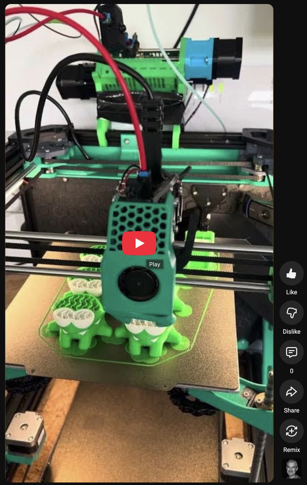
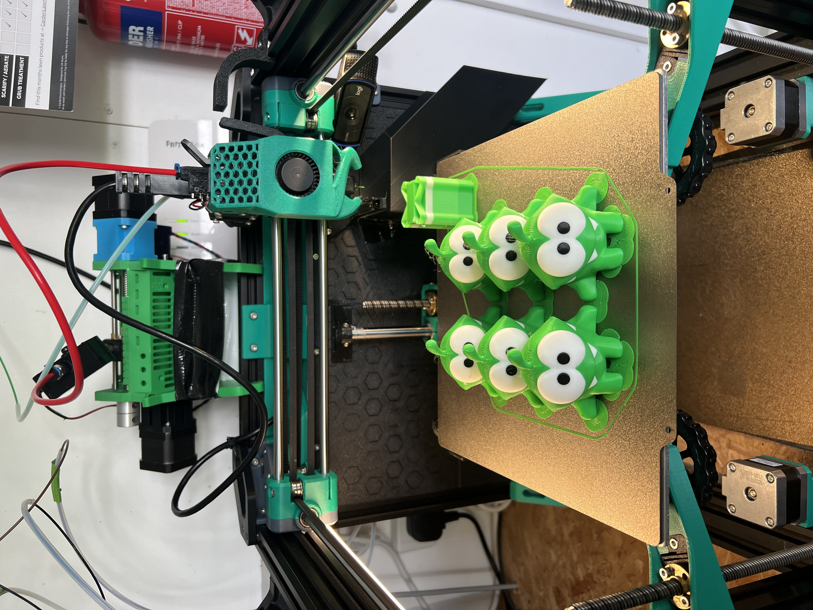
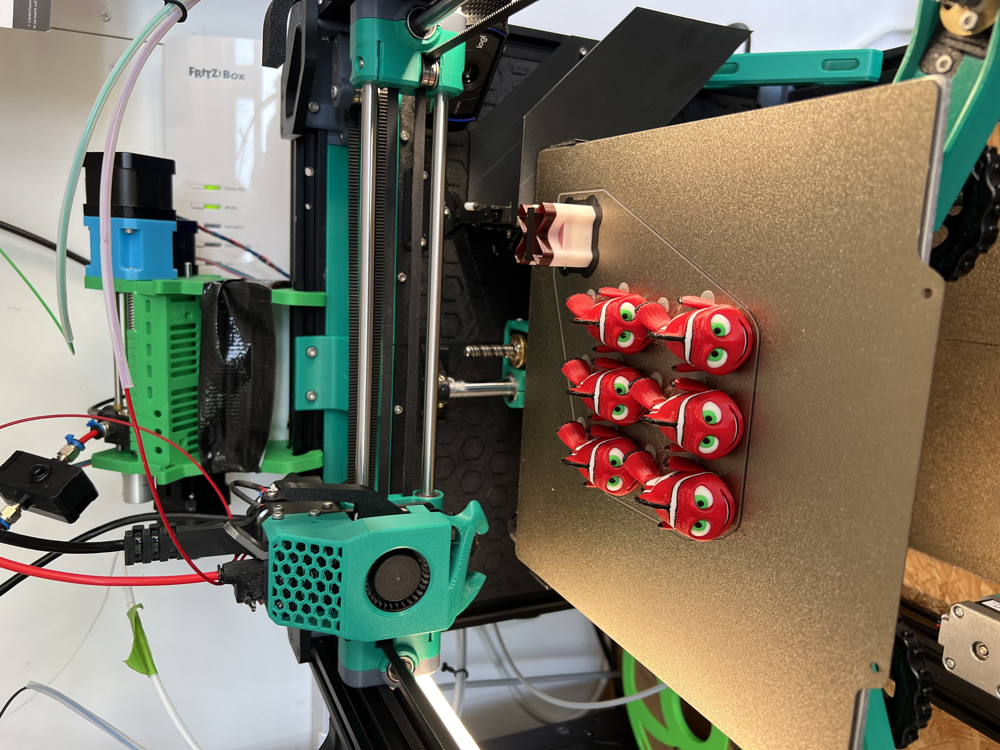
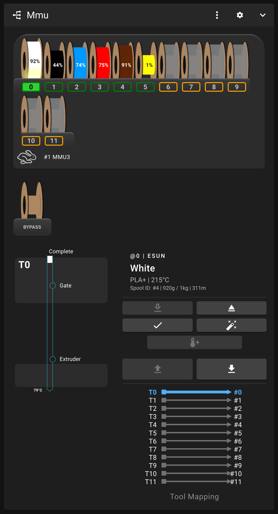

# Klipper MMU3
<p>
<a target="_blank" href="https://youtube.com/shorts/FKF2l-djico?si=fWCuRNJlEBNnSdm8" rel="noopener noreferrer">
</a>


</p>

This project contains the required config and code files to enable MMU3
hardware on klipper based 3d printers.

This is based on the GCode macro based version distributed with Klipper. But,
it is quite a bit enhanced and all the functionality has been moved to Python.
This itself supplied a better development environment for all the features
missing on the original version. On top of the original version this has the
following features:

- Support for [MMU3-12x project](https://github.com/cjbaar/prusa-mmu-12x)
- Sensorless homing for the selector and idler.
- MMU specific menus
- Mainsail prompts
- Mainsail / Fluidd MMU panel support (gate colors, materials, live status)
- Spoolman filament usage tracking per gate
- Cut filament in MMU functionality (Only available for MMU3-5x)
- Smoother load/unload experience
- Filament motion sensor support for increased load/unload reliability
- Operation statistics (toolchange counts, failure counts, per-tool
  toolchange tallies) for both the printer's lifetime and the current job
- Easier path to future implementations

> [!CAUTION]
>
> Currently the Prusa MMBoard is not supported by Klipper, as the board relies
> on "shift registers". A Klipper ready board is recommended in place of the
> Prusa MMBoard. For the development of this extension an SKR Mini E3 v3 is
> utilized, and all the example [configuration files](./sample_configs/E3NG_v1.2/)
> are based on that.

## Installation

### Automated installation

Just run the following to automatically install the extension:

```shell
cd ~
git clone https://github.com/eoyilmaz/klipper-mmu3.git
cd klipper-mmu3
./install.sh
```

See the [Post Installation](#post-installation-both-automatic-and-manual-installation)
section for post installation steps.

### Manual Installation

For manual installation follow these steps:

1. Download the source:

   ```shell
   cd ~
   git clone https://github.com/eoyilmaz/klipper-mmu3.git
   cd ~/klipper-mmu3
   ```

2. Link the source files:

   ```shell
   ln -sf ./extras/mmu3.py ~/klipper/klippy/extras/
   ln -sf ./extras/mmu3_mainsail_prompts.py ~/klipper/klippy/extras/
   ln -sf ./extras/mmu3_gate_map.py ~/klipper/klippy/extras/
   ln -sf ./extras/mmu3_hh_compat.py ~/klipper/klippy/extras/
   ```

3. Copy/link the config files:

   ```shell
   cd klipper-mmu3
   cp ~/klipper-mmu3/mmu3.cfg ~/printer_data/config/
   cp ~/klipper-mmu3/mmu3-12x.cfg ~/printer_data/config/
   ln -sf ~/klipper-mmu3/mmu3_menus.cfg ~/printer_data/config/
   ln -sf ~/klipper-mmu3/beep.cfg ~/printer_data/config/
   ```

4. Add the following lines to your `printer.cfg`:

   ```ini
   [respond]
   [include mmu3.cfg]
   ```

   or for MMU3-12x setup use:

   ```ini
   [respond]
   [include mmu3-12x.cfg]
   ```

5. You can also optionally add an update section to `moonraker` for subsequent
updates via `Fluidd` / `Mainsail` update managers.

   ```ini
   [update_manager klipper-mmu3]
   type: git_repo
   path: ~/klipper-mmu3/
   origin: https://github.com/eoyilmaz/klipper-mmu3.git
   primary_branch: main
   managed_services: klipper
   ```

### Post Installation (both automatic and manual installation)

Update `mmu3.cfg`/`mmu3-12x.cfg` according to your setup.

Specifically update the `filament_switch_sensor_name`,
`filament_switch_sensor_position` and `filament_motion_sensor_name` parameters
to match your printer config.

   ```ini
   [mmu3 MMU3]
   filament_switch_sensor_name: filament_switch_sensor my_filament_sensor
   filament_switch_sensor_position: on_gears  # pre_gears, post_gears
   filament_motion_sensor_name: filament_motion_sensor encoder_sensor
   ```

If you don't have a filament motion sensor you can omit it, but a filament
switch sensor is needed. The `filament_switch_sensor_position` defines where
the switch sensor is positioned and changes the behavior of the system. There
are several values to choose from, for a classical Prusa printer where the
switch sensor is on the gears you can set it to `on_gears`. If the filament
switch sensor is before the gears (between FINDA sensor and gears) set it to
`pre_gears` and `post_gears` if the sensor is positioned after the gears
(between the gears and the hotend).

If you'd like MMU3's lifetime operation statistics (see `MMU_STATS` below)
to survive a restart, also add a `[save_variables]` section to your
`printer.cfg`, if you don't already have one for something else:

   ```ini
   [save_variables]
   filename: ~/printer_data/config/mmu3_variables.cfg
   ```

This is optional - without it, MMU3 still works, it just keeps the lifetime
counters in memory only.

## Usage

It is very hard to explain all the functionalities here.

You can investigate [sample configurations](./sample_configs/E3NG_v1.2/) to
update your `printer.cfg` and slicer (currently Orca Slicer) GCode commands.

Typically you don't need to know all the commands, the menus supply all the
necessary functionality to prepare MMU for printing and troubleshoot.

Just add the following GCode to your Machine start G-Code, somewhere after all
the normal homing, bed leveling stuff finished and before any filament is used:

```gcode
T[initial_tool]
```

The extension supplies all the necessary gcode commands.

1. `Tx`

   The tool change command, i.e. `T0`, `T1`, `T2`, `T3`, `T4`, `T5`, `T6`,
   `T7`, `T8`, `T9`, `T10`, `T11`.

2. `MMU_HOME`

   Homes the MMU idler and selector. Typically add this to your Machine start
   G-Code command as explained above.

3. `HOME_IDLER`

   Homes the idler only.

4. `HOME_MMU_ONLY`

   Homes the idler and selector, and tries to load the filament 0 to FINDA to
   verify everything is working fine and unloads it. Very rarely used...

5. `MMU_SELECT` / `MMU_UNSELECT`

   Selects the requested gate (`GATE=` or `VALUE=`), or parks the idler:

   ```gcode
   MMU_SELECT GATE=0
   ```

6. `LOAD_FILAMENT_TO_FINDA` / `UNLOAD_FILAMENT_FROM_FINDA`

   Loads/Unloads the filament to FINDA.

7. `LOAD_FILAMENT_TO_EXTRUDER` / `UNLOAD_FILAMENT_FROM_EXTRUDER`

   Loads/Unloads the filament from extruder.

8. `MMU_UNLOCK`

   Unlocks the MMU by moving the idler to the home position. Mostly needed when
   you need to pull/push the filament manually.

9. `MMU_RETRY`

   Retries the load/unload operation that failed and left the MMU paused. The
   MMU remembers what it was doing (which `Tx`, load or unload) and how far it
   got, so you don't have to - `MMU_RETRY` re-checks the FINDA / switch / motion
   sensors and resumes from where the filament actually is instead of starting
   the whole sequence over. `printer["mmu3 MMU3"].pending_operation` and
   `.filament_pos` report the current recovery state.

10. `RESUME_MMU` / `RESUME_MMU FORCE=1`

   `RESUME_MMU` runs `MMU_RETRY` first and only resumes the print if the
   recovery succeeds. `RESUME_MMU FORCE=1` clears the pending operation and
   resumes anyway - use it when you have already fixed the filament by hand.

11. `CUT_FILAMENT_IN_EXTRUDER`

   This macro is defined in the `mmu3.cfg` and controls the movement required
   to cut the filament inside the extruder. This is called by the `Tx` commands
   if the `enable_filament_cutter` is set to `True`.

12. `PULLEY_CALIBRATE`

   This command is used to calibrate the pulley `rotation_distance` value. The
   process works like this:

   - Home the MMU.
   - Insert a filament to any of the channels.
   - Select the same channel.
   - And run `PULLEY_CALIBRATE`.
   - The filament will be first pulled to the FINDA.
   - The MMU will wait for 10 seconds, so that the user can mark the filament,
     ideally behind the MMU.
   - The MMU will pull exactly 100 mm of filament.
   - Mark the filament again.
   - Unload the tool (`MMU_UNLOAD`).
   - Pull the filament out and measure the distance between the marks.
   - Adjust the `rotation_distance` value of the `pulley_stepper` in your
     `mmu3.cfg` file by `{current_value} * {measured_distance} / 100`.

13. `MMU_STATS` / `MMU_STATS_RESET_JOB`

   `MMU_STATS` prints a summary of the operation statistics tracked for
   every top level MMU operation (tool changes, loads, unloads, homes, cuts
   and ejects): how many times each was attempted, how many failed, and a
   tally of successful tool changes by from/to tool. Two independent sets
   are tracked and also exposed as `printer["mmu3 MMU3"].total_stats` /
   `.job_stats`:

   - `total_stats` - lifetime totals for the printer. These are persisted
     via Klipper's `save_variables` (see [Post Installation](#post-installation-both-automatic-and-manual-installation))
     and survive restarts. Without `[save_variables]` configured, they are
     kept in memory only.
   - `job_stats` - statistics for the current print job only. These reset
     automatically whenever a new print starts (detected via `[print_stats]`)
     or manually with `MMU_STATS_RESET_JOB`.

   These are also available on your display, under `MMU` -> `Statistics`,
   which shows the toolchange/load/unload/home counts (and failures) for
   both the current job and the printer's lifetime, and offers `Reset Job
   Stats` and `Print Full Report` (runs `MMU_STATS`, useful when the display
   is too small to show everything, e.g. the per-tool toolchange tally).

14. `MMU_LOAD` / `MMU_UNLOAD` / `MMU_EJECT`

   `MMU_LOAD` loads the filament of a gate to the nozzle (`MMU_LOAD GATE=2`,
   without `GATE=` the selected gate is loaded). `MMU_UNLOAD` unloads the
   filament from the nozzle back to the MMU. `MMU_EJECT` does the same and also
   parks the idler, so the filament can be pulled out by hand (same as
   `M702`).

15. `MMU_MOTORS_OFF`

   Turns off the MMU stepper motors.

16. `MMU_GATE_MAP`

   Shows or edits what is loaded in each gate. This is normally done from the
   Mainsail / Fluidd MMU panel (see
   [Mainsail / Fluidd MMU Panel & Spoolman](#mainsail--fluidd-mmu-panel--spoolman)),
   but works from the console too:

   ```gcode
   MMU_GATE_MAP                  ; print the gate map
   MMU_GATE_MAP GATE=0 NAME="Galaxy Black" MATERIAL=PLA COLOR=1A1A1A TEMP=215
   MMU_GATE_MAP GATE=0 SPOOLID=12 ; assign Spoolman spool 12 to gate 0
   MMU_GATE_MAP GATE=0 SPOOLID=-1 ; unassign the spool
   MMU_GATE_MAP GATE=0 AVAILABLE=0 ; mark the gate as empty (1: available)
   MMU_GATE_MAP RESET=1          ; clear all gates
   ```

> [!NOTE]
>
> The following commands were renamed to match Happy Hare's naming, which the
> Mainsail / Fluidd MMU panels use. The old names still work but print a
> deprecation warning, please update your slicer G-code and macros:
>
> | Old             | New            |
> |-----------------|----------------|
> | `HOME_MMU`      | `MMU_HOME`     |
> | `UNLOCK_MMU`    | `MMU_UNLOCK`   |
> | `LT`            | `MMU_LOAD`     |
> | `UT`            | `MMU_UNLOAD`   |
> | `SELECT_TOOL`   | `MMU_SELECT`   |
> | `UNSELECT_TOOL` | `MMU_UNSELECT` |

The following is the list of all the commands available, most of them are
internally used and will be removed in the future as they are not supplying any
user facing functionality, but are residues from the previous GCode Macro based
design.

   ```gcode
   EJECT_BEFORE_HOME
   EJECT_FROM_EXTRUDER
   EJECT_RAMMING
   ENDSTOPS_STATUS
   GET_MMU_PARAM
   HOME_IDLER
   HOME_MMU_ONLY
   K0  ; Not supported with MMU3-12x
   K1  ; Not supported with MMU3-12x
   K2  ; Not supported with MMU3-12x
   K3  ; Not supported with MMU3-12x
   K4  ; Not supported with MMU3-12x
   LOAD_FILAMENT_FROM_FINDA_TO_EXTRUDER
   LOAD_FILAMENT_TO_EXTRUDER
   LOAD_FILAMENT_TO_FINDA
   LOAD_FILAMENT_TO_FINDA_IN_LOOP
   LOAD_FILAMENT_TO_HOTEND
   M702
   MMU_CHANGE_TOOL  ; only with enable_mmu_panel
   MMU_CHECK_GATE   ; only with enable_mmu_panel
   MMU_CHECK_GATES  ; only with enable_mmu_panel
   MMU_DISABLE
   MMU_EJECT
   MMU_ENABLE
   MMU_GATE_MAP     ; only with enable_mmu_panel
   MMU_HOME
   MMU_LOAD
   MMU_MOTORS_OFF
   MMU_PRELOAD      ; only with enable_mmu_panel
   MMU_RECOVER      ; only with enable_mmu_panel
   MMU_RETRY
   MMU_SELECT
   MMU_STATS
   MMU_STATS_RESET_JOB
   MMU_UNLOAD
   MMU_UNLOCK
   MMU_UNSELECT
   PAUSE_MMU
   PRE_LOAD_FILAMENT_TO_FINDA
   PULLEY_CALIBRATE
   RESUME_MMU
   RETRY_LOAD_FILAMENT_TO_HOTEND
   RETRY_UNLOAD_FILAMENT_FROM_HOTEND
   SET_MMU_PARAM
   T0
   T1
   T2
   T3
   T4
   T5
   T6
   T7
   T8
   T9
   T10
   T11
   UNLOAD_FILAMENT_FROM_EXTRUDER
   UNLOAD_FILAMENT_FROM_EXTRUDER_TO_FINDA
   UNLOAD_FILAMENT_FROM_FINDA
   UNLOAD_FILAMENT_FROM_HOTEND
   UNLOAD_FILAMENT_FROM_HOTEND_WITH_RAMMING
   ```

## Mainsail / Fluidd MMU Panel & Spoolman

Mainsail (v2.15 and later) and Fluidd (v1.34 and later) ship an MMU panel built
for [Happy Hare](https://github.com/moggieuk/Happy-Hare). The MMU3 extension
reports its state in the same format, so the panel works without any changes to
Mainsail or Fluidd. On the Mainsail dashboard, add the "MMU" panel from the
interface settings if it doesn't show up by itself.



The panel shows:

- every gate with the color, material and name of its filament,
- the selected gate and the loaded tool,
- where the filament is (at FINDA, at the extruder, loaded) and what the MMU is
  doing right now (Selecting, Loading, Unloading, Homing, Cutting Filament,
  ...),
- the reason when the MMU paused itself.

It also has buttons to select, load, unload, eject, preload a gate, check one
or all gates for filament, home, unlock and recover the MMU. Clicking a gate's filament opens the gate
editor, where you can set the filament name, material, color and temperature,
or pick a Spoolman spool.

`MMU_CHECK_GATE` checks the selected gate and `MMU_CHECK_GATES` checks all
gates. Each gate's filament is fed to FINDA and back, and the gate is marked
available or empty. An empty gate doesn't pause the MMU, the check moves on to
the next gate. Both commands accept Happy Hare's `GATE=`, `GATES=0,2,3`,
`TOOL=`, `TOOLS=`, `ALL=1` and `QUIET=1`, and are refused while filament is
loaded.

This is enabled by default and can be turned off in `[mmu3 MMU3]`:

```ini
[mmu3 MMU3]
enable_mmu_panel: True
spoolman_support: readonly  # off, readonly
```

Add a `[save_variables]` section to your `printer.cfg` (see
[Post Installation](#post-installation-both-automatic-and-manual-installation)),
so the gate map survives restarts.

### Spoolman

To track filament usage per spool with [Spoolman](https://github.com/Donkie/Spoolman):

1. Add a `[spoolman]` section to your `moonraker.conf`:

   ```ini
   [spoolman]
   server: http://<spoolman-host>:7912
   ```

2. In the MMU panel, open a gate and pick its spool from Spoolman. The gate
   takes the spool's filament name, material, color and temperature.

Every time a gate is loaded, the MMU3 sets its spool as Moonraker's active
spool, and when the filament is unloaded the active spool is cleared. Moonraker
then records the extruded filament against the right spool.

A spool can only be assigned to one gate, assigning it to another gate removes
it from the previous one. The gate to spool mapping is stored in Klipper
(`save_variables`), it isn't written back to Spoolman.

### Not supported

The MMU3 always loads gate `n` for tool `n`. The following Happy Hare features
aren't available, and their buttons only print a "not supported" message:
tool-to-gate remapping, endless spool, bypass, gear motor sync, and loading
or unloading the extruder only.
