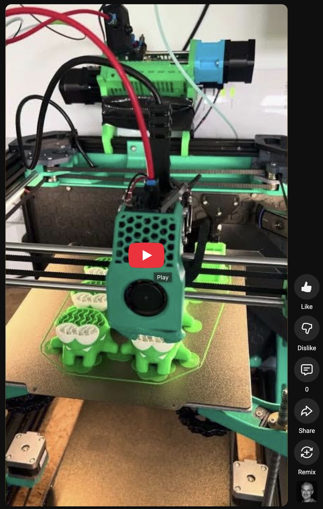
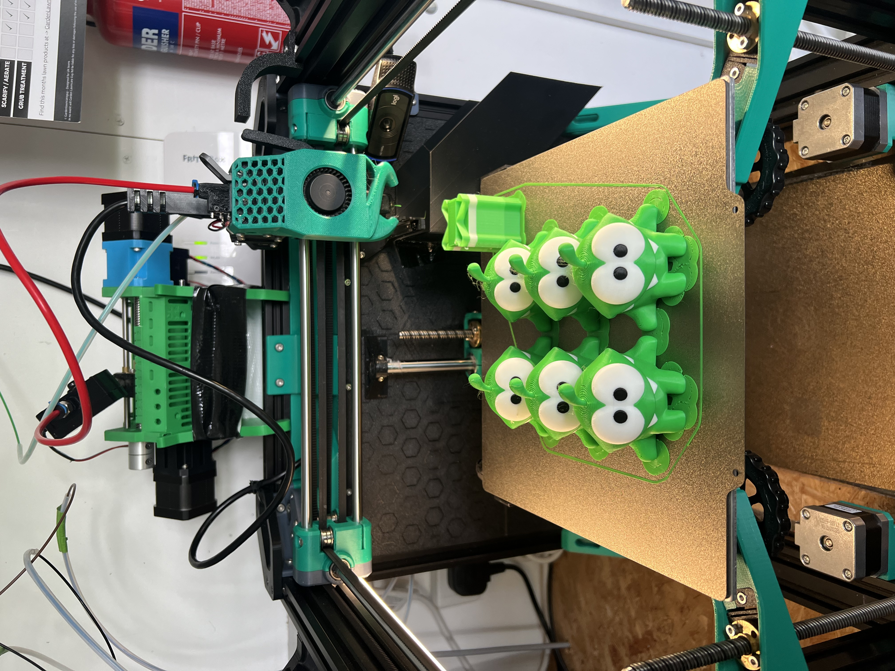
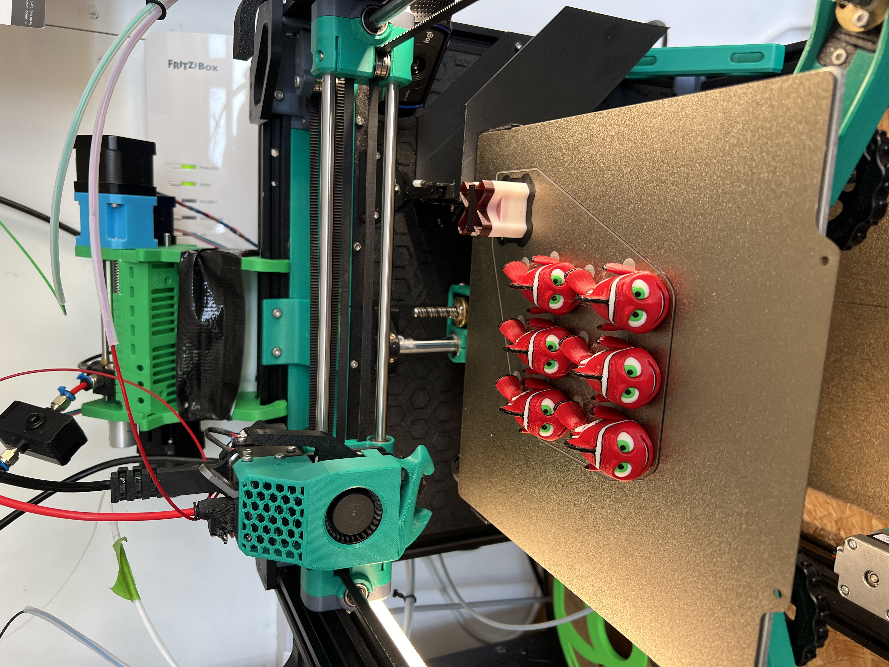
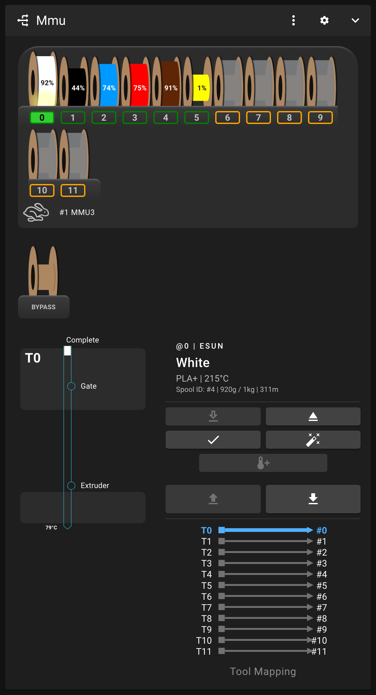

# Klipper MMU3
<p>
<a target="_blank" href="https://youtube.com/shorts/FKF2l-djico?si=fWCuRNJlEBNnSdm8" rel="noopener noreferrer">
</a>


</p>

This project contains the required config and code files to enable MMU3
hardware on klipper based 3d printers.

This is based on the GCode macro based version distributed with Klipper. But,
it is quite a bit enhanced and all the functionality has been moved to Python.
This itself supplied a better development environment for all the features
missing on the original version. On top of the original version this has the
following features:

- Support for [MMU3-12x project](https://github.com/cjbaar/prusa-mmu-12x)
- Sensorless homing for the selector and idler.
- MMU specific menus
- Mainsail prompts
- Mainsail / Fluidd MMU panel support (gate colors, materials, live status)
- Spoolman filament usage tracking per gate
- Cut filament in MMU functionality (Only available for MMU3-5x)
- Smoother load/unload experience
- Filament motion sensor support for increased load/unload reliability
- Operation statistics (toolchange counts, failure counts, per-tool
  toolchange tallies) for both the printer's lifetime and the current job
- Easier path to future implementations

> [!CAUTION]
>
> Currently the Prusa MMBoard is not supported by Klipper, as the board relies
> on "shift registers". A Klipper ready board is recommended in place of the
> Prusa MMBoard. For the development of this extension an SKR Mini E3 v3 is
> utilized, and all the example [configuration files](./sample_configs/E3NG_v1.2/)
> are based on that.

## Installation

### Automated installation

Just run the following to automatically install the extension:

```shell
cd ~
git clone https://github.com/eoyilmaz/klipper-mmu3.git
cd klipper-mmu3
./install.sh
```

See the [Post Installation](#post-installation-both-automatic-and-manual-installation)
section for post installation steps.

### Manual Installation

For manual installation follow these steps:

1. Download the source:

   ```shell
   cd ~
   git clone https://github.com/eoyilmaz/klipper-mmu3.git
   cd ~/klipper-mmu3
   ```

2. Link the source files:

   ```shell
   ln -sf ./extras/mmu.py ~/klipper/klippy/extras/
   ln -sf ./extras/mmu3.py ~/klipper/klippy/extras/
   ln -sf ./extras/mmu_mainsail_prompts.py ~/klipper/klippy/extras/
   ln -sf ./extras/mmu_gate_map.py ~/klipper/klippy/extras/
   ln -sf ./extras/mmu_hh_compat.py ~/klipper/klippy/extras/
   ```

3. Copy/link the config files:

   ```shell
   cd klipper-mmu3
   cp ~/klipper-mmu3/mmu.cfg ~/printer_data/config/
   cp ~/klipper-mmu3/mmu-12x.cfg ~/printer_data/config/
   ln -sf ~/klipper-mmu3/mmu_menus.cfg ~/printer_data/config/
   ln -sf ~/klipper-mmu3/beep.cfg ~/printer_data/config/
   ```

4. Add the following lines to your `printer.cfg`:

   ```ini
   [respond]
   [include mmu.cfg]
   ```

   or for MMU3-12x setup use:

   ```ini
   [respond]
   [include mmu-12x.cfg]
   ```

5. You can also optionally add an update section to `moonraker` for subsequent
updates via `Fluidd` / `Mainsail` update managers.

   ```ini
   [update_manager klipper-mmu3]
   type: git_repo
   path: ~/klipper-mmu3/
   origin: https://github.com/eoyilmaz/klipper-mmu3.git
   primary_branch: main
   managed_services: klipper
   ```

### Post Installation (both automatic and manual installation)

> [!IMPORTANT]
>
> The config section was renamed from `[mmu3 MMU3]` to Happy Hare's `[mmu]`,
> and the extension is now reported as `printer.mmu` instead of
> `printer["mmu3 MMU3"]`. The files lost their MMU3 names too: `mmu3.cfg` /
> `mmu3-12x.cfg` / `mmu3-12x-ng.cfg` are now `mmu.cfg` / `mmu-12x.cfg` /
> `mmu-12x-ng.cfg`, `mmu3_menus.cfg` is `mmu_menus.cfg`, and the Klipper
> modules are `extras/mmu*.py`. When updating from an older version:
>
> 1. Run `./install.sh` again. It links the new modules, installs `mmu.cfg` /
>    `mmu-12x.cfg` and replaces the `[include mmu3*.cfg]` in your
>    `printer.cfg` with it. Your old `mmu3*.cfg` file is left untouched.
> 2. Copy your settings from the old `mmu3*.cfg` file to the new one.
> 3. Replace `printer["mmu3 MMU3"]` / `printer['mmu3 MMU3']` with `printer.mmu`
>    in your own macros. `printer.mmu.filament_pos` is now Happy Hare's
>    number, the MMU3 position name moved to `printer.mmu.filament_pos_name`.
>
> The lifetime statistics and the gate map are saved as `mmu_total_stats` /
> `mmu_gate_map` now, the old `mmu3_*` values are read until the new ones are
> saved. Klipper refuses to start with a leftover `[mmu3 MMU3]` section and
> prints these steps.

Update `mmu.cfg`/`mmu-12x.cfg` according to your setup.

Specifically update the `filament_switch_sensor_name`,
`filament_switch_sensor_position` and `filament_motion_sensor_name` parameters
to match your printer config.

   ```ini
   [mmu]
   filament_switch_sensor_name: filament_switch_sensor my_filament_sensor
   filament_switch_sensor_position: on_gears  # pre_gears, post_gears
   filament_motion_sensor_name: filament_motion_sensor encoder_sensor
   ```

If you don't have a filament motion sensor you can omit it, but a filament
switch sensor is needed. The `filament_switch_sensor_position` defines where
the switch sensor is positioned and changes the behavior of the system. There
are several values to choose from, for a classical Prusa printer where the
switch sensor is on the gears you can set it to `on_gears`. If the filament
switch sensor is before the gears (between FINDA sensor and gears) set it to
`pre_gears` and `post_gears` if the sensor is positioned after the gears
(between the gears and the hotend).

If you'd like MMU3's lifetime operation statistics (see `MMU_STATS` below)
to survive a restart, also add a `[save_variables]` section to your
`printer.cfg`, if you don't already have one for something else:

   ```ini
   [save_variables]
   filename: ~/printer_data/config/mmu_variables.cfg
   ```

This is optional - without it, MMU3 still works, it just keeps the lifetime
counters in memory only.

## Usage

It is very hard to explain all the functionalities here.

You can investigate [sample configurations](./sample_configs/E3NG_v1.2/) to
update your `printer.cfg` and slicer (currently Orca Slicer) GCode commands.

Typically you don't need to know all the commands, the menus supply all the
necessary functionality to prepare MMU for printing and troubleshoot.

### Slicer G-code

The slicer G-code follows the Happy Hare style. The
[sample slicer G-code](./sample_configs/E3NG_v1.2/machine_gcode/) (Orca
Slicer) has the full versions, the MMU related parts are:

- [Machine start G-code](./sample_configs/E3NG_v1.2/machine_gcode/machine_start.gcode):
  tell the MMU which tools the print uses (optional, see
  `MMU_SLICER_TOOL_MAP`), call `MMU_PRINT_START` at the beginning, and load
  the first tool after all the homing, bed leveling etc. is finished and
  before any filament is used:

  ```gcode
  MMU_SLICER_TOOL_MAP RESET=1 INITIAL_TOOL=[initial_tool] TOTAL_TOOLCHANGES=[total_toolchanges]
  {if is_extruder_used[0]}MMU_SLICER_TOOL_MAP TOOL=0 COLOR="{filament_colour[0]}" MATERIAL="{filament_type[0]}" TEMP={nozzle_temperature_initial_layer[0]} NAME="{filament_settings_id[0]}"{endif}
  ; ... the same line for each gate: TOOL=1 with [1], TOOL=2 with [2], ...
  MMU_PRINT_START
  ; ... homing, bed leveling, heating ...
  T[initial_tool]
  ```

- [Change filament G-code](./sample_configs/E3NG_v1.2/machine_gcode/change_filament.gcode):
  change the tool, before the flushing:

  ```gcode
  T[next_extruder]
  ```

- [Machine end G-code](./sample_configs/E3NG_v1.2/machine_gcode/machine_end.gcode):
  unload the filament, turn off the MMU motors and end the MMU print job:

  ```gcode
  MMU_UNLOAD
  MMU_MOTORS_OFF
  MMU_PRINT_END STATE=complete
  ```

`T[initial_tool]` / `T[next_extruder]` are the same as
`MMU_CHANGE_TOOL TOOL=[initial_tool]` / `MMU_CHANGE_TOOL TOOL=[next_extruder]`,
but use the `T` commands in the slicer: the slicer only recognizes a `T`
command as the tool change. With `MMU_CHANGE_TOOL` it adds its own `T` command
after the change filament G-code (after the flushing), and its G-code preview
doesn't see the tool change.

### Commands

The extension supplies all the necessary gcode commands.

1. `Tx`

   The tool change command, i.e. `T0`, `T1`, `T2`, `T3`, `T4`, `T5`, `T6`,
   `T7`, `T8`, `T9`, `T10`, `T11`. `Tn` loads the gate tool `n` is mapped to
   (gate `n` unless you remap it, see `MMU_TTG_MAP`).

2. `MMU_HOME`

   Homes the MMU idler and selector. Typically add this to your Machine start
   G-Code command as explained above.

3. `HOME_IDLER`

   Homes the idler only.

4. `MMU_SELECT` / `MMU_UNSELECT`

   Selects the requested gate (`GATE=` or `TOOL=`), or parks the
   idler:

   ```gcode
   MMU_SELECT GATE=0
   ```

   `TOOL=0` is the gate tool 0 is mapped to (see `MMU_TTG_MAP`), `GATE=`
   names the gate directly and wins if both are given. This applies to all
   commands that take a gate.

5. `MMU_UNLOCK`

   Unlocks the MMU by moving the idler to the home position. Mostly needed when
   you need to pull/push the filament manually.

6. `MMU_RETRY`

   Retries the load/unload operation that failed and left the MMU paused. The
   MMU remembers what it was doing (which `Tx`, load or unload) and how far it
   got, so you don't have to - `MMU_RETRY` re-checks the FINDA / switch / motion
   sensors and resumes from where the filament actually is instead of starting
   the whole sequence over. `printer.mmu.pending_operation` and
   `.filament_pos_name` report the current recovery state.

7. `RESUME_MMU` / `RESUME_MMU FORCE=1`

   `RESUME_MMU` runs `MMU_RETRY` first and only resumes the print if the
   recovery succeeds. `RESUME_MMU FORCE=1` clears the pending operation and
   resumes anyway - use it when you have already fixed the filament by hand.

8. `_MMU_CUT_TIP` / `_MMU_FORM_TIP`

   These macros are defined in the `mmu.cfg`. `_MMU_CUT_TIP` controls the
   movement required to cut the filament inside the extruder, it is called by
   the `Tx` commands (and `MMU_CUT`) if the `enable_filament_cutter` is set to
   `True`. `_MMU_FORM_TIP` rams the filament to form its tip, it is called by
   `MMU_FORM_TIP` and, without a cutter, when the filament is ejected before
   homing. It is Happy Hare's tip forming macro, its settings are the
   variables of `_MMU_FORM_TIP_VARS` (ramming volume, cooling tube position
   and length, cooling moves, skinnydip, ...), tune them with
   `MMU_TEST_FORM_TIP`.

   Tool changes leave ramming to the slicer by default. To use
   `_MMU_FORM_TIP` instead (Happy Hare's `force_form_tip_standalone`), set
   in the `[mmu]` section:

   ```ini
   enable_filament_cutter: False
   force_form_tip_standalone: True
   ```

   Every unload (tool changes, `MMU_UNLOAD`, `MMU_EJECT`) then forms the tip
   of a loaded filament first. Turn off the slicer's ramming (in OrcaSlicer
   `Enable filament ramming`, which also skips its cooling moves), otherwise
   the filament is rammed twice. While printing the macro rams
   `variable_ramming_volume` (0 by default, only the cooling moves),
   otherwise `variable_ramming_volume_standalone`, set `ramming_volume` to
   the value you tuned with `MMU_TEST_FORM_TIP`.

   Or choose it per print in the slicer, without changing the config: call
   `MMU_FORM_TIP` in the change filament G-code right before the tool change
   (and before `MMU_UNLOAD` in the end G-code). The unload then neither cuts
   nor rams the formed tip again. Skip it on the slicer's first tool change
   (`previous_extruder` is -1 there, the start G-code already loaded the tool),
   otherwise that filament is unloaded and loaded again:

   ```gcode
   {if previous_extruder >= 0}MMU_FORM_TIP{endif}
   T[next_extruder]
   ```

   They were called `CUT_FILAMENT_IN_EXTRUDER` and `RAMMING_SLICER` before,
   rename them if your `mmu.cfg` still has the old names (Klipper stops with
   this message until you do).

9. `PULLEY_CALIBRATE`

   This command is used to calibrate the pulley `rotation_distance` value. The
   process works like this:

   - Home the MMU.
   - Insert a filament to any of the channels.
   - Select the same channel.
   - And run `PULLEY_CALIBRATE`.
   - The filament will be first pulled to the FINDA.
   - The MMU will wait for 10 seconds, so that the user can mark the filament,
     ideally behind the MMU.
   - The MMU will pull exactly 100 mm of filament.
   - Mark the filament again.
   - Unload the tool (`MMU_UNLOAD`).
   - Pull the filament out and measure the distance between the marks.
   - Adjust the `rotation_distance` value of the `pulley_stepper` in your
     `mmu.cfg` file by `{current_value} * {measured_distance} / 100`.

10. `MMU_STATS` / `MMU_STATS_RESET_JOB`

   `MMU_STATS` prints a summary of the operation statistics tracked for
   every top level MMU operation (tool changes, loads, unloads, homes and
   cuts): how many times each was attempted, how many failed, and a
   tally of successful tool changes by from/to tool. Two independent sets
   are tracked and also exposed as `printer.mmu.total_stats` /
   `.job_stats`:

   - `total_stats` - lifetime totals for the printer. These are persisted
     via Klipper's `save_variables` (see [Post Installation](#post-installation-both-automatic-and-manual-installation))
     and survive restarts. Without `[save_variables]` configured, they are
     kept in memory only.
   - `job_stats` - statistics for the current print job only. These reset
     automatically whenever a new print starts (see `MMU_PRINT_START` below)
     or manually with `MMU_STATS_RESET_JOB`.

   These are also available on your display, under `MMU` -> `Statistics`,
   which shows the toolchange/load/unload/home counts (and failures) for
   both the current job and the printer's lifetime, and offers `Reset Job
   Stats` and `Print Full Report` (runs `MMU_STATS`, useful when the display
   is too small to show everything, e.g. the per-tool toolchange tally).

11. `MMU_LOAD` / `MMU_UNLOAD` / `MMU_EJECT`

   `MMU_LOAD` loads the filament of a gate to the nozzle (`MMU_LOAD GATE=2`
   or `MMU_LOAD TOOL=2`, without a gate the selected gate is loaded). `MMU_UNLOAD` unloads the
   filament from the nozzle back to the MMU. `MMU_EJECT` does the same and also
   parks the idler, so the filament can be pulled out by hand (same as
   `M702`).

12. `MMU_MOTORS_OFF`

   Turns off the MMU stepper motors.

13. `MMU_GATE_MAP`

   Shows or edits what is loaded in each gate. This is normally done from the
   Mainsail / Fluidd MMU panel (see
   [Mainsail / Fluidd MMU Panel & Spoolman](#mainsail--fluidd-mmu-panel--spoolman)),
   but works from the console too:

   ```gcode
   MMU_GATE_MAP                  ; print the gate map
   MMU_GATE_MAP GATE=0 NAME="Galaxy Black" MATERIAL=PLA COLOR=1A1A1A TEMP=215
   MMU_GATE_MAP GATE=0 SPOOLID=12 ; assign Spoolman spool 12 to gate 0
   MMU_GATE_MAP GATE=0 SPOOLID=-1 ; unassign the spool
   MMU_GATE_MAP GATE=0 AVAILABLE=0 ; mark the gate as empty (1: available)
   MMU_GATE_MAP RESET=1          ; clear all gates
   ```

   A gate is marked empty when loading it to FINDA fails. To also mark it
   empty when the spool runs out during a print, and to continue the print
   with endless spool (see `MMU_ENDLESS_SPOOL`), call `MMU_RUNOUT` from the
   `runout_gcode` of your filament switch sensor (Klipper has no runout event
   the MMU could listen to):

   ```ini
   [filament_switch_sensor my_filament_sensor]
   switch_pin: ...
   pause_on_runout: False
   runout_gcode:
     MMU_RUNOUT
   ```

   `MMU_RUNOUT` marks the loaded gate empty and, with endless spool, loads
   the next gate of its group and the print continues. Otherwise it pauses
   the print with `PAUSE`, so don't add a `PAUSE` after it (an older config
   with one still works, but pauses after an endless spool swap too).

   Klipper only runs `runout_gcode` while printing, and the MMU turns the
   sensor off while it loads or unloads, so tool changes never mark a gate
   empty. `MMU_RUNOUT` ignores the runout while the MMU is busy. If no
   filament is loaded or the MMU is disabled, it only pauses the print. If
   FINDA still detects filament, the spool didn't run out: the nozzle is
   clogged, or the filament is tangled, broken or stuck between FINDA and the
   sensor (this is common with a `pre_gears` sensor). The gate is then not
   marked empty and the print pauses.

   A filament motion sensor (or another runout sensor) between FINDA and the
   filament switch sensor can call `MMU_RUNOUT` too:

   ```ini
   [filament_motion_sensor encoder_sensor]
   switch_pin: ...
   pause_on_runout: False
   runout_gcode:
     MMU_RUNOUT
   ```

   It fires before the switch sensor. `MMU_RUNOUT` then uses FINDA to tell a
   clog from a runout: with filament in FINDA it pauses the print as above,
   with FINDA empty the spool ran out. The end of the filament is then past
   the MMU and can't be unloaded, so the gate is marked empty and the print
   uses up the rest of the filament. When its end reaches the switch sensor,
   the switch sensor's `MMU_RUNOUT` continues with endless spool or pauses. If
   the extruder uses more than `runout_tail_length` (in `[mmu]`, default
   100 mm) before that, the end of the filament is stuck and the print
   pauses. Set it to the filament length between the two sensors plus a
   margin. Without FINDA (`enable_no_selector_mode: True`) a clog can't be
   told from a runout, the print always pauses.

14. `MMU ENABLE=0|1`

   Enables (`MMU ENABLE=1`) or disables (`MMU ENABLE=0`) the MMU. Disabling also
   turns off the MMU motors. Without `ENABLE=` it prints whether the MMU is
   enabled.

15. `MMU_STATUS`

   Prints a summary of the MMU state: enabled / homed / paused, the selected
   and loaded gates, the loaded tool, the filament position, the current action,
   whether endless spool is enabled, the pending (failed) operation and the
   gate map.

16. `MMU_HELP`

   Lists the MMU commands with a one-line description each. Klipper's `HELP`
   shows the same descriptions.

17. `MMU_PRINT_START` / `MMU_PRINT_END`

   Start and end the MMU print job, same as in Happy Hare. `MMU_PRINT_START`
   resets the job statistics and sets the `print_state` the MMU panel shows to
   `printing`. `MMU_PRINT_END STATE=complete` sets it to `complete`
   (`STATE=` also takes `cancelled`, `error`, `ready` and `standby`). Both do
   nothing if the print job has already started / ended.

   `MMU_PRINT_START` also checks the tools the print uses (see
   `MMU_SLICER_TOOL_MAP`) against the gates, even if the print job has
   already started, and prints a warning if a tool loads an empty gate or a
   gate with a different material. The print goes on, fix the gate map or the
   tool-to-gate map before the tool is needed. When the print job ends, the
   tools are cleared.

   The materials must be the same (ignoring case), so name them the same in
   the slicer's filament "Type" and in Spoolman: `PLA` in the slicer doesn't
   fit a `PLA+` spool (Orca Slicer's "Type" also takes names that aren't in
   its list). Materials that aren't set aren't checked. Colors and filament
   names aren't compared.

   You don't have to call them. With `print_start_detection: True` (the
   default) the MMU starts and ends the print job when Klipper's
   `[print_stats]` does. If your print start / end G-code calls them, you can
   set `print_start_detection: False` in `[mmu]`, the job then only starts and
   ends with these commands. Pausing and resuming are always detected.

18. `MMU_TTG_MAP` / `MMU_REMAP_TTG`

   Shows or edits the tool-to-gate (TTG) map, same as in Happy Hare: which
   gate each tool (`Tn`, `MMU_CHANGE_TOOL TOOL=n`) loads. By default tool `n`
   loads gate `n`. This is normally done from the tool mapping dialog of the
   Mainsail / Fluidd MMU panel, but works from the console too:

   ```gcode
   MMU_TTG_MAP                   ; print the map
   MMU_TTG_MAP TOOL=2 GATE=4     ; T2 loads gate 4
   MMU_TTG_MAP MAP=0,0,0,0,0     ; set the whole map, the gate of each tool
   MMU_TTG_MAP GATE=4 AVAILABLE=1 ; also mark gate 4 available (0: empty)
   MMU_TTG_MAP RESET=1           ; tool n loads gate n again
   ```

   `QUIET=1` doesn't print the map after a change. `MMU_REMAP_TTG` is the same
   command (Happy Hare's older name). Several tools can map to the same gate,
   e.g. to print a multi-color file with one filament. The map is saved with
   `save_variables` and survives restarts.

   `MMU_CHANGE_TOOL GATE=n` bypasses the map and loads gate `n` as the tool
   mapped to it. `MMU_RECOVER TOOL=2 GATE=4` tells the MMU that T2 is loaded
   from gate 4 and remaps T2 to gate 4.

19. `MMU_ENDLESS_SPOOL`

   Shows or edits endless spool, same as in Happy Hare: when a spool runs out
   during a print, the tool continues with the next gate of the same endless
   spool group and the print goes on. Gates with the same group number form a
   group. This is normally done from the tool mapping dialog of the Mainsail /
   Fluidd MMU panel, but works from the console too:

   ```gcode
   MMU_ENDLESS_SPOOL                     ; print the settings
   MMU_ENDLESS_SPOOL ENABLE=1            ; enable (0: disable)
   MMU_ENDLESS_SPOOL GROUPS=0,0,0,1,1    ; gates 0-2 are group A, 3-4 group B
   MMU_ENDLESS_SPOOL RESET=1             ; back to the [mmu] config values
   ```

   `QUIET=1` doesn't print the settings after a change. The defaults come from
   `[mmu]`, changes are saved with `save_variables` and survive restarts:

   ```ini
   [mmu]
   endless_spool_enabled: False
   endless_spool_groups: 0, 1, 2, 3, 4  # each gate in its own group
   ```

   It needs `MMU_RUNOUT` in the `runout_gcode` of the filament switch sensor,
   and optionally of a motion sensor before it, to also detect clogs (see
   `MMU_GATE_MAP`). A clog never starts endless spool. On a runout at the
   switch sensor, `MMU_RUNOUT` marks the gate empty and
   checks the other gates of its group in order (after the gate, wrapping
   around), skipping the empty ones. The first one found is loaded:

   1. `PAUSE` parks the toolhead with your pause macro,
   2. `_MMU_ENDLESS_SPOOL_PRE_UNLOAD` runs, if you defined it,
   3. the loaded tool is remapped to the new gate in the TTG map (see
      `MMU_TTG_MAP`),
   4. the new gate is loaded like a `Tn` tool change (the new filament
      pushes the rest of the old one ahead of it),
   5. `_MMU_ENDLESS_SPOOL_POST_LOAD` runs, if you defined it, e.g. to wipe
      the nozzle (see [Callback macros](#callback-macros)),
   6. `RESUME` continues the print.

   If no gate of the group is left, the print pauses instead. If the tool
   change fails, the MMU pauses with the recovery dialog like a failed `Tn`,
   `RESUME_MMU` retries it and resumes the print. `MMU_TTG_MAP` shows each
   tool's group while endless spool is enabled.

20. `MMU_FORM_TIP` / `MMU_TEST_FORM_TIP` / `MMU_CUT`

   Run the tip forming (`_MMU_FORM_TIP`) or the in-extruder cut
   (`_MMU_CUT_TIP`) on its own, to test and tune the
   macros without a tool change. The filament must be loaded and the extruder
   hot enough (`min_temp_extruder`), `MMU_CUT` also needs
   `enable_filament_cutter: True`. The filament is left in the extruder
   afterwards, `MMU_UNLOAD` takes it out to the MMU without ramming it again,
   so you can look at the tip.

   To tune the tip without the MMU, like in Happy Hare, push a filament into
   the extruder by hand (FINDA must not see it) down to the nozzle, heat up
   and run `MMU_TEST_FORM_TIP`. The MMU doesn't need to be homed and doesn't
   move, the tip is formed and the filament is ejected from the extruder gears
   (`FINAL_EJECT=1`) so you can pull it out:

   ```gcode
   M109 S215                                ; heat up
   ; push the filament into the extruder until it comes out of the nozzle
   MMU_TEST_FORM_TIP COOLING_MOVES=3        ; form the tip and eject it
   ; pull the filament out, look at the tip, snip it off and repeat
   ```

   `MMU_TEST_FORM_TIP` (and `MMU_FORM_TIP`, its alias like in Happy Hare)
   changes the `_MMU_FORM_TIP_VARS` before forming the tip, so you can tune
   it without editing `mmu.cfg` and restarting Klipper:

   ```gcode
   MMU_TEST_FORM_TIP SHOW=1                 ; list the variables
   MMU_TEST_FORM_TIP COOLING_MOVES=3        ; change one and form the tip
   MMU_TEST_FORM_TIP USE_SKINNYDIP=True SKINNYDIP_DISTANCE=25 RUN=0  ; only set them
   MMU_TEST_FORM_TIP RESET=1                ; back to the mmu.cfg values
   ```

   Any parameter other than `SHOW`, `RESET` and `RUN` is a variable name,
   with or without the `variable_` prefix, an unknown name changes nothing.
   The changes last until Klipper restarts. `MMU_TEST_FORM_TIP` lists the
   variables each time in the `mmu.cfg` format, copy the values that work
   to `_MMU_FORM_TIP_VARS`. Happy Hare's `EXTRUDER_ONLY` is not needed: the
   MMU3 never moves the pulley during tip forming.

21. `MMU_SLICER_TOOL_MAP`

   Records the tools the print uses, with their colors and materials, same
   as in Happy Hare. `MMU_PRINT_START` then warns if a tool loads an empty
   gate or a gate with a different material, and the MMU panel shows the
   tool changes done out of the print's total ("Printing (3/12 swaps)").
   Happy Hare reads the tools from the G-code file with its Moonraker
   component, the MMU3 takes them from the slicer's start G-code instead, so
   nothing needs to be installed in Moonraker. Add these lines before
   `MMU_PRINT_START` (Orca Slicer placeholders, one `TOOL=` line for each gate
   of your MMU, see the
   [sample start G-code](./sample_configs/E3NG_v1.2/machine_gcode/machine_start.gcode)
   for all 12):

   ```gcode
   MMU_SLICER_TOOL_MAP RESET=1 INITIAL_TOOL=[initial_tool] TOTAL_TOOLCHANGES=[total_toolchanges]
   {if is_extruder_used[0]}MMU_SLICER_TOOL_MAP TOOL=0 COLOR="{filament_colour[0]}" MATERIAL="{filament_type[0]}" TEMP={nozzle_temperature_initial_layer[0]} NAME="{filament_settings_id[0]}"{endif}
   {if is_extruder_used[1]}MMU_SLICER_TOOL_MAP TOOL=1 COLOR="{filament_colour[1]}" MATERIAL="{filament_type[1]}" TEMP={nozzle_temperature_initial_layer[1]} NAME="{filament_settings_id[1]}"{endif}
   ; ... TOOL=2, TOOL=3, ...
   ```

   Keep the quotes around `COLOR` and `NAME`: Klipper reads an unquoted `#`
   as the start of a comment, and names can have spaces. The
   `{if is_extruder_used[n]}` lines only add the tools the print uses, and
   also work when the project has fewer filaments than the MMU has gates.

   These lines don't print anything. Without arguments the command prints the
   tools, the gates they load and the warnings, `DETAIL=1` also lists the
   tools the print doesn't use:

   ```gcode
   MMU_SLICER_TOOL_MAP           ; print the tools of the print
   MMU_SLICER_TOOL_MAP DETAIL=1  ; also the unused tools
   MMU_SLICER_TOOL_MAP RESET=1   ; forget the tools
   ```

   `TOOL=` also takes `USED=0` for a tool the print doesn't use, `QUIET=1`
   doesn't print anything. The tools are reported in `printer.mmu.slicer_tool_map`
   (Happy Hare's format). Happy Hare's `PURGE_VOLUMES=`, `AUTOMAP=` and
   `SKIP_AUTOMAP=` are ignored, the MMU3 doesn't calculate purge volumes or
   map tools to gates automatically.

> [!NOTE]
>
> The following commands were renamed to match Happy Hare's naming, which the
> Mainsail / Fluidd MMU panels use. The old names were deprecated in 1.3.0
> and 1.4.0 and are now removed, please update your slicer G-code and macros:
>
> | Old             | New            |
> |-----------------|----------------|
> | `HOME_MMU`      | `MMU_HOME`     |
> | `UNLOCK_MMU`    | `MMU_UNLOCK`   |
> | `LT`            | `MMU_LOAD`     |
> | `UT`            | `MMU_UNLOAD`   |
> | `SELECT_TOOL`   | `MMU_SELECT`   |
> | `UNSELECT_TOOL` | `MMU_UNSELECT` |
> | `MMU_ENABLE`    | `MMU ENABLE=1` |
> | `MMU_DISABLE`   | `MMU ENABLE=0` |

The following is the list of all the commands available, most of them are
internally used and will be removed in the future as they are not supplying any
user facing functionality, but are residues from the previous GCode Macro based
design.

   ```gcode
   ENDSTOPS_STATUS
   GET_MMU_PARAM
   HOME_IDLER
   K0  ; Not supported with MMU3-12x
   K1  ; Not supported with MMU3-12x
   K2  ; Not supported with MMU3-12x
   K3  ; Not supported with MMU3-12x
   K4  ; Not supported with MMU3-12x
   M702
   MMU
   MMU_CHANGE_TOOL
   MMU_CHECK_GATE
   MMU_CHECK_GATES
   MMU_CUT
   MMU_EJECT
   MMU_ENDLESS_SPOOL
   MMU_FORM_TIP
   MMU_GATE_MAP
   MMU_HELP
   MMU_HOME
   MMU_LOAD
   MMU_MOTORS_OFF
   MMU_PRELOAD
   MMU_RECOVER
   MMU_RETRY
   MMU_RUNOUT
   MMU_SELECT
   MMU_STATS
   MMU_STATS_RESET_JOB
   MMU_STATUS
   MMU_TEST_FORM_TIP
   MMU_TTG_MAP
   MMU_REMAP_TTG
   MMU_UNLOAD
   MMU_UNLOCK
   MMU_UNSELECT
   PAUSE_MMU
   PULLEY_CALIBRATE
   RESUME_MMU
   SET_MMU_PARAM
   T0
   T1
   T2
   T3
   T4
   T5
   T6
   T7
   T8
   T9
   T10
   T11
   ```

### Callback macros

Same as in Happy Hare, the MMU calls these macros at fixed points of a load /
unload if you define them, so you can add your own moves, purges or LED
effects. Nothing is called for a macro you don't define.

| Macro                 | Called                                                              |
|-----------------------|---------------------------------------------------------------------|
| `_MMU_PRE_UNLOAD`     | Before an unload starts, before the filament is cut in the extruder |
| `_MMU_POST_UNLOAD`    | After the filament is unloaded to the MMU                           |
| `_MMU_PRE_LOAD`       | Before a load starts, before the gate is selected                   |
| `_MMU_POST_LOAD`      | After the filament is loaded to the nozzle (e.g. to purge or wipe)  |
| `_MMU_ACTION_CHANGED` | On every change of the MMU action, with `ACTION` and `OLD_ACTION`   |
| `_MMU_ENDLESS_SPOOL_PRE_UNLOAD` | Before an endless spool tool change, the print is paused  |
| `_MMU_ENDLESS_SPOOL_POST_LOAD`  | After an endless spool tool change, before the print resumes (e.g. to wipe the nozzle) |

A tool change calls the unload macros and then the load macros. The load /
unload macros are skipped when there is nothing to load / unload, and the
moves they make are finished before the MMU continues. An error in one of them
fails the load / unload like a failing MMU step does, so the print is paused
and the recovery dialog is shown. An error in `_MMU_ACTION_CHANGED` is only
reported.

An endless spool tool change (see `MMU_ENDLESS_SPOOL`) is a tool change, so
it calls the load / unload macros too, and the two endless spool macros
around them. If an endless spool macro fails, the print stays paused and
`RESUME` continues it. If the tool change itself fails, `RESUME_MMU` retries
it and resumes the print without calling `_MMU_ENDLESS_SPOOL_POST_LOAD`, so
wipe the nozzle yourself before that if needed. For example, to wipe off the
purged filament:

```ini
[gcode_macro _MMU_ENDLESS_SPOOL_POST_LOAD]
gcode:
    PURGE_PLATFORM_RETRACT  ; your own macros
    WIPE_NOZZLE
    PURGE_PLATFORM_EXTEND
```

`ACTION` and `OLD_ACTION` are Happy Hare's action names (`Idle`, `Loading`,
`Unloading`, `Loading Ext`, `Unloading Ext`, `Forming Tip`, `Cutting Tip`,
`Heating`, `Checking`, `Homing`, `Selecting`, `Cutting Filament`):

```ini
[gcode_macro _MMU_ACTION_CHANGED]
gcode:
    
        SET_LED LED=mmu_leds RED=0 GREEN=0 BLUE=0
    
        SET_LED LED=mmu_leds RED=0 GREEN=0 BLUE=1
    
```

### Tools and gates

As in Happy Hare, a **tool** is what the slicer asks for (`T0`, `T1`, ...,
`MMU_CHANGE_TOOL TOOL=`) and a **gate** is a physical lane of the MMU, where a
spool is fed in. By default the MMU3 loads gate `n` for tool `n`, the
tool-to-gate map (`MMU_TTG_MAP`, or the panel's tool mapping dialog) changes
that.

Your own macros can read the selected and the loaded gate from
`printer.mmu.current_gate` and `printer.mmu.loaded_gate` (`None` if there is
none). The old names `printer.mmu.current_tool` and
`printer.mmu.current_filament` still work and have the same values, but use
the new ones in new macros. Happy Hare's `printer.mmu.gate`,
`printer.mmu.tool` (the tool mapped to the loaded gate) and
`printer.mmu.ttg_map` are reported too.

`GET_MMU_PARAM` / `SET_MMU_PARAM` use the new names as well:
`PARAM=current_gate` / `PARAM=loaded_gate` instead of `PARAM=current_tool` /
`PARAM=current_filament`. The config options (`number_of_tools`, ...) keep
their names.

The "Select Tool" and "Unselect Tool" entries of the LCD menu are now "Select
Gate" / "Unselect Gate" (with `Gate 0`, `Gate 1`, ... entries, also under
"Preload Filament to Finda"), and "Unload Tool" / "Eject Tool" are "Unload" /
"Eject". If you override these menus, use the new IDs (`__select_gate __gate0`,
`__unselect_gate`, `__unload`, `__eject`, `__preload_filament_to_finda
__gate0`).

## Mainsail / Fluidd MMU Panel & Spoolman

Mainsail (v2.15 and later) and Fluidd (v1.34 and later) ship an MMU panel built
for [Happy Hare](https://github.com/moggieuk/Happy-Hare). The MMU3 extension
reports its state in the same format, so the panel works without any changes to
Mainsail or Fluidd. On the Mainsail dashboard, add the "MMU" panel from the
interface settings if it doesn't show up by itself.



The panel shows:

- every gate with the color, material and name of its filament,
- the selected gate and the loaded tool,
- where the filament is (at FINDA, at the extruder, loaded) and what the MMU is
  doing right now (Selecting, Loading, Unloading, Homing, Cutting Filament,
  ...),
- the reason when the MMU paused itself,
- while printing, the tool changes done out of the print's total, if the start
  G-code calls `MMU_SLICER_TOOL_MAP`.

It also has buttons to select, load, unload, eject, preload a gate, check one
or all gates for filament, home, unlock and recover the MMU. Clicking a gate's filament opens the gate
editor, where you can set the filament name, material, color and temperature,
or pick a Spoolman spool. The tool mapping dialog maps each tool to a gate
(see `MMU_TTG_MAP`) and sets the endless spool groups (see
`MMU_ENDLESS_SPOOL`).

`MMU_CHECK_GATE` checks the selected gate and `MMU_CHECK_GATES` checks all
gates. Each gate's filament is fed to FINDA and back, and the gate is marked
available or empty. An empty gate doesn't pause the MMU, the check moves on to
the next gate. Both commands accept Happy Hare's `GATE=`, `GATES=0,2,3`,
`TOOL=`, `TOOLS=`, `ALL=1` and `QUIET=1`, and are refused while filament is
loaded.

The panel support is always on. Spoolman support is set in `[mmu]`:

```ini
[mmu]
spoolman_support: readonly  # off, readonly
```

Add a `[save_variables]` section to your `printer.cfg` (see
[Post Installation](#post-installation-both-automatic-and-manual-installation)),
so the gate map, the tool-to-gate map and the endless spool settings survive
restarts.

### Spoolman

To track filament usage per spool with [Spoolman](https://github.com/Donkie/Spoolman):

1. Add a `[spoolman]` section to your `moonraker.conf`:

   ```ini
   [spoolman]
   server: http://<spoolman-host>:7912
   ```

2. In the MMU panel, open a gate and pick its spool from Spoolman. The gate
   takes the spool's filament name, material, color and temperature.

Every time a gate is loaded, the MMU3 sets its spool as Moonraker's active
spool, and when the filament is unloaded the active spool is cleared. Moonraker
then records the extruded filament against the right spool.

A spool can only be assigned to one gate, assigning it to another gate removes
it from the previous one. The gate to spool mapping is stored in Klipper
(`save_variables`), it isn't written back to Spoolman.

### Not supported

The following Happy Hare features aren't available, and their buttons only
print a "not supported" message: bypass, gear motor sync, and loading or
unloading the extruder only.
The panel's "T macro color" setting isn't supported either, the MMU3's `Tn`
commands aren't macros.

### Known differences

The panels read some Happy Hare settings from the `[mmu]` config section. The
MMU3 doesn't set these, so the panels use their defaults:

- `gate_homing_endstop`: Happy Hare's name for FINDA is `mmu_gate`, but the
  panels don't know FINDA is the gate homing sensor. When the filament is
  parked at FINDA, the panel draws it slightly past the gate, and doesn't
  highlight FINDA as the sensor it stopped at.
- `extruder_homing_endstop`: with the filament switch sensor at `pre_gears` or
  `on_gears`, Mainsail ends the bowden bar a little past the extruder sensor.
  When the filament reaches the sensor it is drawn at the right place.
